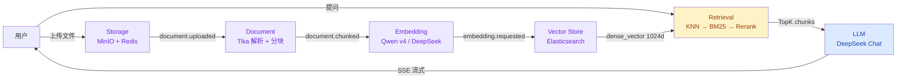

# IntraMind

**IntraMind** 是一个本地知识库 AI 助手，支持文档上传、自动解析分块、向量化存储、混合检索，内置 AI 助手「茉莉」，通过 DeepSeek / Qwen 大模型提供智能问答。

> 代码库名为 **LocalRAG**。项目从 RAG 系统学习实践起步，逐步扩展为完整知识库产品后更名为 IntraMind（[GitHub](https://github.com/dirge2024/IntraMind)）。本地目录保留 LocalRAG 以保持既有开发环境不变。

核心技术栈包括 Spring Boot 3.3.5、Elasticsearch 8.10、Kafka、MinIO、MySQL 和 Redis。

## 项目说明

- 目标：从零搭建 RAG 工作流，深入理解文档处理、向量检索和 LLM 对话的全链路实现
- 重点：文档解析与分块策略、KNN + BM25 混合检索、对话历史管理与会话持久化
- 方式：按数据流方向分模块开发，逐模块自测通过后进入下一环节

## 系统架构



## 系统功能
<!-- SCREENSHOT: 系统运行时截图 -->


## 技术栈

### 后端

| 类别 | 技术 | 版本 |
|------|------|------|
| 框架 | Spring Boot | 3.3.5 (Java 17) |
| 数据库 | MySQL | 8.0 |
| ORM | Spring Data JPA | — |
| 缓存 | Redis | 7.x |
| 搜索引擎 | Elasticsearch | 8.10.4 |
| 消息队列 | Apache Kafka | KRaft 模式 |
| 文件存储 | MinIO | RELEASE.2025-04 |
| 文档解析 | Apache Tika | 2.9.1 |
| 中文分词 | HanLP | portable-1.8.6 |
| 嵌入模型 | 通义千问 text-embedding-v4 | 1024 维 |
| 对话模型 | DeepSeek Chat | — |
| 依赖管理 | Maven | 多模块 |

### 前端

纯静态 HTML + CSS + JavaScript，内嵌在 Spring Boot 中，无需额外构建工具。

## 项目结构

```
LocalRAG/
├── backend/                          # 后端 Maven 多模块工程
│   ├── pom.xml                       # 父 POM（依赖版本管理）
│   ├── common/                       # 公共模块：Result、异常、Payload DTO
│   ├── storage/                      # MinIO + Redis + MySQL
│   ├── messaging/                    # Kafka 生产者封装
│   ├── document/                     # Tika 解析 + 三级降级分块
│   ├── embedding/                    # Qwen/DeepSeek 向量化
│   ├── vector-store/                 # ES 索引 + dense_vector 存储
│   ├── retrieval/                    # KNN→BM25→rescore 混合检索
│   ├── llm/                          # DeepSeek 对话 + 会话管理
│   └── api/                          # Spring Boot 入口 + Controller + 前端静态页
├── docker-compose.yml                # MySQL + Redis + Kafka + MinIO + ES
├── .env.example                      # 环境变量模板
├── 需求分析/                          # 开发文档（需求/方案/问题记录）
└── readme.md
```

### 模块依赖方向

```
common → storage → messaging → document → embedding → vector-store → retrieval → llm → api
```

后层依赖前层，禁止反向依赖。

### API 模块静态资源

```
backend/api/src/main/resources/static/
├── common.css              # 共享侧边栏 + 弹窗 + 按钮样式
├── index.html              # 控制台首页
├── upload.html             # 文件上传（分片/直传）
├── kb.html                 # 知识库文件列表
├── chat.html               # 对话助手
└── sessions.html           # 历史会话管理
```

## 核心功能

### 1. 文件上传与存储

- MinIO composeObject 服务端合并分片，应用层不做文件 IO
- Redis 追踪上传进度（key=upload:{md5}，TTL 24h），支持断点续传
- 相同 MD5 秒传，避免重复存储
- 前端 spark-md5 客户端计算 MD5

<!-- SCREENSHOT: 文件上传页面 -->

### 2. 文档解析与分块

- Apache Tika 统一解析（PDF / Word / TXT / Markdown 等 1000+ 格式）
- 三级降级分块策略：段落 → 句子 → HanLP 分词
- 每块 ≤ 512 字符，相邻块 15% 重叠
- 通过 Kafka 异步触发解析流程

### 3. 向量化

- 通义千问 text-embedding-v4（1024 维）与 DeepSeek Embedding 双实现
- 每批 10 条调用 API，3 次指数退避重试
- 通过 `@ConditionalOnProperty` 配置切换模型，零代码改动

### 4. 向量存储与检索

- ES 8.10 dense_vector(1024, cosine) + ik_max_word 分词
- 三级瀑布检索：KNN 向量召回 Top 30 → BM25 关键词重排 → rescore 精排
- 删除文件时同步清理 ES 中的 chunk

<!-- SCREENSHOT: 知识库管理页面 -->

### 5. AI 助手「茉莉」

- 内置 AI 助手名称：**茉莉**
- DeepSeek Chat API + SSE 流式输出
- RAG Prompt 拼接：系统提示词 + 参考资料（含来源标注）+ 历史对话（近 15 条）
- 仅基于知识库回答，无匹配时提示「知识库中不存在相关信息」
- 聊天记录双层存储：Redis（当天热数据 24h TTL）+ MySQL（全量持久）

<!-- SCREENSHOT: 对话助手页面 -->

### 6. 会话管理

- 多轮对话支持，侧边栏 4 个一级导航入口
- 会话列表支持搜索、时间筛选、置顶、重命名、删除
- 首条消息自动取前 20 字为标题
- 自定义确认弹窗代替浏览器原生弹窗

<!-- SCREENSHOT: 历史会话页面 -->

## RAG 全链路

```
上传文件 → MinIO → Kafka(document.uploaded)
  → Tika 解析 → 三级降级分块 → Kafka(document.chunked)
  → Qwen/DeepSeek 向量化(1024d) → Kafka(embedding.requested)
  → ES 存储(text + dense_vector)
  → 用户提问 → 向量化 → KNN→BM25→rescore → DeepSeek 生成 → SSE 流式输出
```

## 前置环境

- Java 17
- Maven 3.8+
- Docker Desktop（用于运行中间件）
- 通义千问 API Key（嵌入模型）
- DeepSeek API Key（对话模型）

## 快速启动

### 1. 启动中间件

```bash
docker compose up -d
```

验证：

```bash
docker ps --format "table {{.Names}}\t{{.Status}}"
```

### 2. 配置 API Key

```bash
cp backend/api/src/main/resources/application-local.example.yml \
   backend/api/src/main/resources/application-local.yml
```

编辑 `application-local.yml`，填入真实 Key。

### 3. 构建并启动

```bash
cd backend
mvn clean install -DskipTests
mvn spring-boot:run -pl api
```

### 4. 访问

| 地址 | 功能 |
|------|------|
| http://localhost:8088 | 控制台首页 |
| http://localhost:8088/upload.html | 文件上传 |
| http://localhost:8088/kb.html | 知识库管理 |
| http://localhost:8088/chat.html | 对话助手 |
| http://localhost:8088/sessions.html | 历史会话 |
| http://localhost:8088/api/health | 健康检查 |
| http://localhost:19001 | MinIO 控制台（dirge / wsy2642@） |

### 5. 使用流程

1. 打开上传页面上传文档（PDF/Word/TXT）
2. 等待知识库状态变为「已入库」
3. 打开对话助手提问
4. 在历史会话中查看和管理对话记录

## API 概览

| 模块 | 端点 | 说明 |
|------|------|------|
| Storage | `POST /api/storage/upload/init` | 初始化分片上传 |
| Storage | `POST /api/storage/upload/part` | 上传分片 |
| Storage | `POST /api/storage/upload/complete` | 合并分片完成 |
| Storage | `POST /api/storage/upload/direct` | 小文件直传 |
| Storage | `GET /api/storage/files` | 知识库文件列表 |
| Storage | `GET /api/storage/download/{md5}` | 下载文件 |
| Storage | `DELETE /api/storage/file/{md5}` | 删除文件（含 ES） |
| Retrieval | `POST /api/retrieval/search` | 检索 TopK chunk |
| LLM | `GET /api/llm/chat` | SSE 流式对话 |
| LLM | `GET /api/llm/history` | 加载聊天记录 |
| LLM | `GET /api/llm/sessions` | 会话列表 |
| LLM | `PUT /api/llm/sessions/{id}` | 更新会话（重命名/置顶） |
| LLM | `DELETE /api/llm/sessions/{id}` | 删除会话 |
| Health | `GET /api/health` | 健康检查 |

## 开发工具

### Impeccable 前端设计 Skill

前端 UI 使用 [Impeccable](https://github.com/pbakaus/impeccable) 设计规范和 CLI 检测工具辅助开发：

```bash
# 安装
git clone git@github.com:pbakaus/impeccable.git
cp -r impeccable/.agents/skills/impeccable .claude/skills/

# 使用
/impeccable layout    # 优化布局和视觉节奏
/impeccable typeset   # 修复字体层次
/impeccable audit     # 运行设计质量检查
```

该 Skill 提供了排版、色彩、空间、交互等 7 个领域的设计规范，以及 23 个设计命令和 27 条确定性反模式规则。

## 开发记录

开发过程中记录了 10 个典型问题及排查解决过程，详见 `doc/开发问题.md`。
